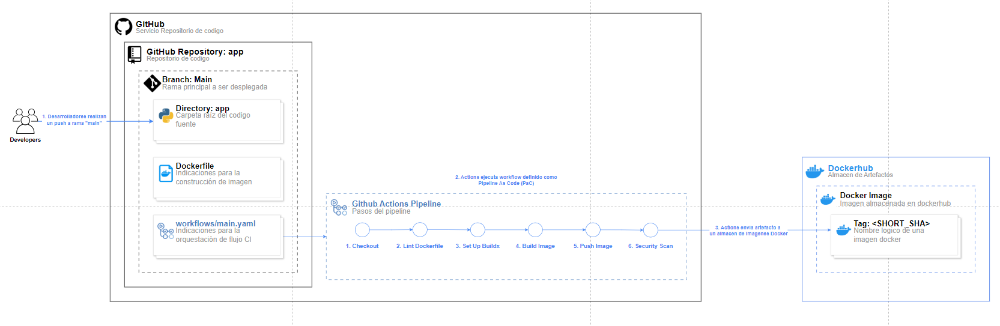
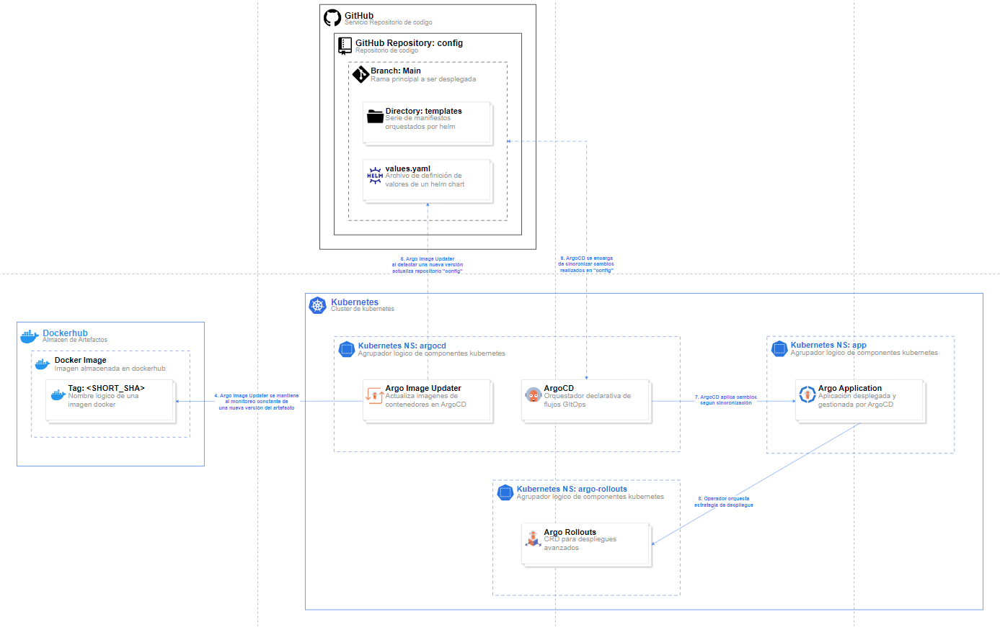
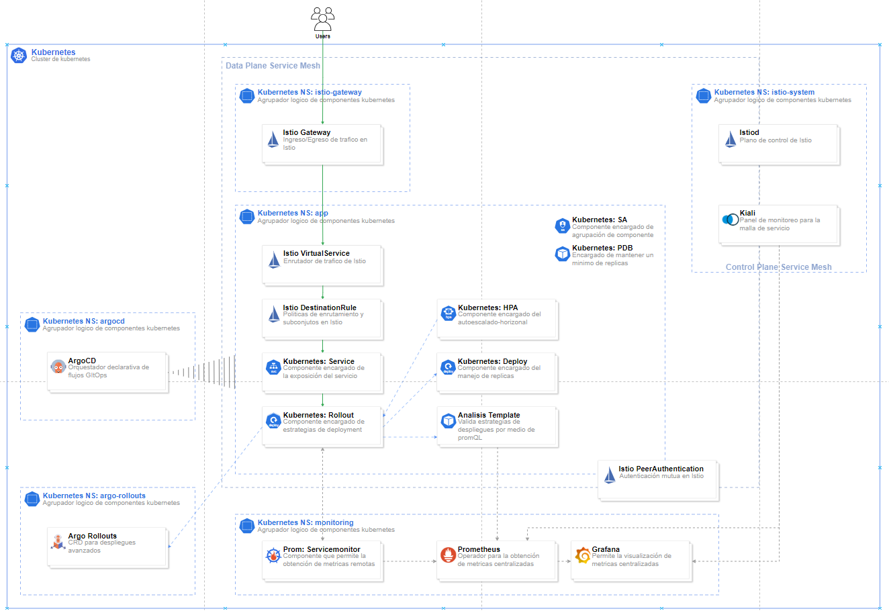

  

<h1 align="center" style="margin-bottom: 0;">Implementando GitOps Avanzado con Argo Rollouts e Istio Gateway</h1>
<h3 align="center" style="margin-top: 5px;">Despliegues Canary y Gestión de Tráfico con Mallas de Servicios</h3>

### Introducción

#### **¿Qué son GitOps, Argo Rollouts, Istio y su Gateway?**

* **GitOps:** Un modelo operativo para la gestión de sistemas cloud-native, incluyendo Kubernetes, donde Git actúa como la única fuente de verdad declarativa para la infraestructura y las aplicaciones. Los cambios en el estado deseado se realizan a través de commits en Git, y los operadores automatizados sincronizan el entorno con este estado.

* **Argo Rollouts:** Un controlador de Kubernetes que extiende las funcionalidades del objeto `Deployment` estándar, proporcionando estrategias de despliegue avanzadas como Canary, Blue/Green y Progressive Rollouts. Permite una introducción gradual y controlada de nuevas versiones de aplicaciones, minimizando el riesgo y facilitando la detección temprana de problemas.

* **Istio:** Una malla de servicios (Service Mesh) de código abierto que proporciona una capa de infraestructura para gestionar la comunicación entre microservicios. Ofrece funcionalidades como gestión de tráfico, seguridad, observabilidad y políticas, sin necesidad de modificar el código de las aplicaciones.

* **Istio Gateway:** Un componente de Istio que actúa como punto de entrada y salida para el tráfico que fluye hacia y desde la malla de servicios. Permite definir cómo el tráfico externo accede a los servicios dentro del clúster, ofreciendo capacidades avanzadas de enrutamiento, control de acceso y terminación TLS. En este contexto, lo utilizaremos para dirigir el tráfico de manera inteligente durante los despliegues canary.

#### **Objetivos de esta Documentación**

* Documentar la implementación conceptual de un flujo de trabajo GitOps robusto para el despliegue de aplicaciones en Kubernetes, utilizando las potentes capacidades de Argo Rollouts e Istio Gateway.

* Detallar el proceso conceptual para llevar a cabo despliegues canary con un control preciso del enrutamiento del tráfico, permitiendo una validación exhaustiva de nuevas versiones antes de su lanzamiento completo.

* Mostrar cómo la integración con Prometheus para la monitorización proporciona la visibilidad necesaria para evaluar la salud y el rendimiento de las aplicaciones durante y después de los despliegues.

* Proporcionar una guía clara y concisa para comprender esta arquitectura y sus beneficios.

#### **Beneficios y Problemas que Resuelve esta Arquitectura**

Esta arquitectura aborda varios desafíos comunes en el despliegue y gestión de aplicaciones en entornos Kubernetes:

* **Despliegues de aplicaciones riesgosos:** Los despliegues tradicionales "todo o nada" pueden introducir inestabilidad y causar interrupciones significativas en producción. Los despliegues canary permiten una introducción gradual y controlada, reduciendo el impacto de posibles problemas.

* **Falta de control granular del tráfico durante los despliegues:** Las estrategias de despliegue básicas de Kubernetes pueden carecer de la capacidad para dirigir el tráfico de manera precisa entre diferentes versiones de una aplicación. La integración de Argo Rollouts con Istio Gateway ofrece un control detallado basado en porcentajes, headers u otros criterios.

* **Observabilidad limitada en el proceso de despliegue:** Sin una monitorización adecuada, es difícil evaluar la salud y el rendimiento de las nuevas versiones durante un despliegue canary. La integración con Prometheus permite recopilar y visualizar métricas clave para tomar decisiones informadas sobre la progresión del despliegue.

* **Procesos de despliegue manuales y propensos a errores:** La adopción de un flujo GitOps automatiza el proceso de despliegue, desde la confirmación del código hasta la implementación en producción, reduciendo la posibilidad de errores humanos y garantizando la consistencia.

* **Dificultad para realizar rollbacks seguros:** En caso de problemas con una nueva versión, un flujo GitOps bien implementado con Argo Rollouts e Istio facilita la reversión al estado anterior de manera rápida y segura.

#### **Estrategias de Enrutamiento en Istio + Argo Rollouts**

Esta sección profundiza en cómo la integración de Istio y Argo Rollouts habilita la distribución y el enrutamiento inteligente del tráfico durante las estrategias de despliegue canary y blue/green.

##### Referencia

* [Implementing GitOps and Canary Deployment with Argo Project and Istio](https://tetrate.io/blog/implementing-gitops-and-canary-deployment-with-argo-project-and-istio/)
* [Documentación Oficial de Argo Rollouts - Gestión de Tráfico con Istio](https://argo-rollouts.readthedocs.io/en/stable/features/traffic-management/istio/)

En esta sección, nos centraremos en explicar cómo se combina Istio con Argo Rollouts para la distribución y el enrutamiento de tráfico durante despliegues canary y blue/green.

##### Conocimientos Previos Recomendados

Para una mejor comprensión de esta sección, se recomienda tener conocimientos sobre:

* **Istio:** Arquitectura general, componentes principales (Pilot, Envoy, Citadel, Galley).
* **Istio Gateway:** Configuración y su rol como punto de entrada/salida.
* **VirtualService de Istio:** Definición de reglas de enrutamiento basadas en atributos de la solicitud.
* **DestinationRule de Istio:** Definición de políticas para los destinos del tráfico, incluyendo subconjuntos y pesos.
* **Estrategias de Despliegue:** Conceptos y diferencias entre despliegues Canary, Blue/Green y Rolling Updates.
* **Kubernetes Deployments y ReplicaSets:** Cómo Kubernetes gestiona las aplicaciones y sus réplicas.
* **GitOps y Argo CD:** El modelo operativo basado en Git y la herramienta para la sincronización continua en Kubernetes.

##### Introducción a la Integración de Istio y Argo Rollouts

Istio, como malla de servicios, proporciona las herramientas fundamentales para la manipulación del tráfico dentro de un clúster de Kubernetes. Argo Rollouts complementa estas capacidades al automatizar la gestión de despliegues avanzados, como canary y blue/green, orquestando las modificaciones necesarias en los recursos de Istio para lograr el enrutamiento deseado en cada etapa del despliegue. La combinación de ambos permite una gestión de tráfico altamente precisa y la implementación de despliegues seguros y progresivos.

##### Diagrama y Explicación de Estrategias de Despliegue
 

  

* **Despliegue Blue/Green:**
    * **Proceso:** Despliega una nueva versión de la aplicación en un conjunto de pods completamente separado del entorno de producción actual (el "azul"). Una vez que la nueva versión (el "verde") está en funcionamiento y ha pasado las pruebas necesarias, todo el tráfico se redirige repentinamente del "azul" al "verde".
    * **Ventajas:** Proporciona un rollback instantáneo en caso de problemas, ya que la versión anterior permanece activa hasta el cambio de tráfico. Ideal para actualizaciones mayores donde se requiere alta confianza y cero tiempo de inactividad perceptible por el usuario.
    * **Consideraciones:** Requiere el doble de recursos (CPU, memoria) durante el despliegue, ya que ambas versiones deben estar en ejecución simultáneamente.

* **Despliegue Canary:**
    * **Proceso:** Introduce gradualmente la nueva versión de la aplicación a un pequeño porcentaje de usuarios (los "canarios"). Se monitorizan las métricas de rendimiento y los posibles errores en esta pequeña porción de tráfico. Si la nueva versión se comporta de manera estable, el porcentaje de tráfico dirigido a ella se aumenta progresivamente hasta que reemplaza por completo la versión anterior.
    * **Ventajas:** Permite identificar y mitigar problemas en la nueva versión con un impacto mínimo en la mayoría de los usuarios. Facilita la recopilación de feedback real de usuarios en un entorno de producción controlado.
    * **Consideraciones:** Requiere una monitorización detallada y la definición de criterios claros para determinar el éxito o el fracaso de la versión canary en cada etapa.

La elección entre Blue/Green y Canary depende de los requisitos específicos del despliegue, el nivel de riesgo que se esté dispuesto a asumir y la necesidad de un rollback instantáneo versus una validación gradual.

##### La Estrategia de Despliegue de Kubernetes y su Limitación

El recurso `Deployment` de Kubernetes es fundamental para gestionar la implementación y las actualizaciones de aplicaciones stateless. Utiliza `ReplicaSets` para asegurar la disponibilidad del número deseado de réplicas y ofrece estrategias de actualización como `RollingUpdate` y `Recreate`.

* **Gestión de ReplicaSets:** Un `Deployment` crea y gestiona `ReplicaSets`, que a su vez controlan los pods de la aplicación. La especificación `spec.replicas` define el número deseado de instancias. Durante una actualización, el `Deployment` ajusta el número de réplicas entre los `ReplicaSets` antiguos y nuevos.
* **Políticas de Actualización:**
    * **`RollingUpdate`:** Actualiza los pods de forma gradual, reemplazando las instancias antiguas con las nuevas mientras asegura un número mínimo de réplicas disponibles y un máximo de réplicas adicionales. Es la política por defecto y minimiza la interrupción.
    * **`Recreate`:** Elimina todos los pods de la versión anterior antes de crear los nuevos, lo que resulta en un tiempo de inactividad durante la transición.
* **Control de Versiones:** Los `Deployments` utilizan etiquetas en los `ReplicaSets` y los pods para rastrear las diferentes versiones de la aplicación, facilitando el control durante las actualizaciones.

Si bien los `Deployments` proporcionan capacidades básicas de actualización gradual, carecen de la granularidad necesaria para implementar estrategias de despliegue canary avanzadas con control de tráfico preciso basado en porcentajes o reglas específicas. Aquí es donde Argo Rollouts e Istio entran en juego.

##### Componentes Clave de Istio para la Gestión de Tráfico en Despliegues

Istio introduce varios recursos personalizados (CRDs) que permiten una gestión de tráfico sofisticada:

* **VirtualService:** Define cómo las solicitudes son enrutadas a los servicios dentro de la malla. Permite definir reglas basadas en diversos atributos de la solicitud, como hosts, paths, headers y pesos, para dirigir el tráfico a diferentes destinos. En el contexto de los despliegues canary, un `VirtualService` se utiliza para dividir el tráfico entre la versión estable y la versión canary de la aplicación.
* **DestinationRule:** Especifica políticas que se aplican al tráfico destinado a un servicio o a un subconjunto específico de instancias de ese servicio. Define aspectos como el balanceo de carga, el protocolo TLS y, crucialmente para los despliegues canary, la definición de **subconjuntos** (subsets) basados en etiquetas de los pods y la asignación de pesos de tráfico entre estos subconjuntos.
* **Control de Tráfico y Políticas:** Istio también ofrece otras funcionalidades de control de tráfico, como limitación de velocidad, inyección de fallos, timeouts y reintentos, que pueden ser relevantes durante las pruebas de las versiones canary.

##### Ventajas de la Integración de Istio con Argo Rollouts

La combinación de Istio con Argo Rollouts ofrece ventajas significativas sobre el uso exclusivo de los `Deployments` de Kubernetes o incluso la gestión manual de los recursos de Istio:

* **Control de Enrutamiento Fino y Dinámico:** Istio permite un enrutamiento preciso basado en una amplia gama de criterios, y Argo Rollouts automatiza la modificación de los `VirtualService` y `DestinationRule` en tiempo real a medida que avanza el despliegue canary.
* **Soporte Nativo para Lanzamientos Avanzados:** Argo Rollouts está diseñado específicamente para implementar estrategias como canary y blue/green, integrándose de forma nativa con las capacidades de gestión de tráfico de Istio.
* **Automatización del Proceso de Despliegue Canary:** Argo Rollouts automatiza los pasos de incremento del tráfico a la versión canary, la ejecución de análisis (a través de `AnalysisTemplate`), y el rollback automático en caso de fallas, basándose en las métricas proporcionadas por sistemas como Prometheus.
* **Integración con GitOps:** Al ser un controlador de Kubernetes, Argo Rollouts se integra perfectamente con flujos de trabajo GitOps, donde las definiciones de los despliegues y las estrategias se gestionan a través de Git.

##### ¿Cómo Funciona la Integración en la Práctica?

Argo Rollouts interactúa con Istio principalmente a través de la manipulación de los recursos `VirtualService` y `DestinationRule`. Cuando se define un `Rollout` (el CRD de Argo Rollouts que reemplaza al `Deployment` para despliegues avanzados) que utiliza una estrategia canary con gestión de tráfico de Istio, Argo Rollouts sigue estos pasos:

1.  **Crea o actualiza una `DestinationRule`:** Define los subconjuntos que representan las diferentes versiones de la aplicación (ej: `stable`, `canary`) basándose en las etiquetas de los pods gestionados por el `Rollout`.
2.  **Crea o actualiza un `VirtualService`:** Define las reglas de enrutamiento para el servicio, dirigiendo el tráfico a los subconjuntos definidos en la `DestinationRule` según los pesos especificados en la estrategia canary del `Rollout`.
3.  **Gestiona el tráfico progresivamente:** A medida que el `Rollout` avanza a través de sus etapas canary (ej: 10% de tráfico a la canary, luego 25%, etc.), Argo Rollouts actualiza dinámicamente los pesos de tráfico en el `VirtualService` para dirigir el porcentaje deseado de solicitudes a la versión canary.
4.  **Realiza análisis (opcional):** Si se configura un `AnalysisTemplate`, Argo Rollouts pausa el despliegue en ciertos puntos y consulta las métricas de Prometheus (u otros sistemas de monitorización) para determinar si la versión canary cumple con los criterios de éxito definidos.
5.  **Promociona o revierte:** Basándose en los resultados del análisis y la configuración del `Rollout`, Argo Rollouts puede promover la versión canary a estable (redirigiendo todo el tráfico) o revertir al estado anterior en caso de problemas.

Como se mencionó anteriormente, Istio ofrece dos enfoques principales para la división ponderada del tráfico, ambos soportados por Argo Rollouts:

1.  **División del tráfico a nivel de host:** (Se mantiene la explicación anterior con sus ventajas y desventajas).
2.  **División del tráfico a nivel de subconjunto:** (Se mantiene la explicación anterior con sus ventajas y desventajas).

La elección del enfoque dependerá de la complejidad de la configuración deseada y de las necesidades específicas del entorno.

##### Diagrama de Funcionamiento de las Estrategias con Istio y Argo Rollouts

 

  

 

Esta sección proporciona una base sólida para comprender cómo Istio y Argo Rollouts se combinan para implementar estrategias de enrutamiento avanzadas. En las siguientes secciones, profundizaremos en la configuración específica y los pasos para implementar este flujo GitOps.

**Diagrama de funcionamiento de distintas estrategias**

 

  

 

#### **Arquitectura Propuesta**

Esta sección presenta la arquitectura propuesta para implementar un flujo GitOps avanzado utilizando Argo Rollouts e Istio Gateway. Se incluyen diagramas de contexto y de flujo detallado para ilustrar los componentes y su interacción conceptual.

##### Diagrama de Contexto

 

  

 

El diagrama de contexto proporciona una visión de alto nivel de la arquitectura propuesta. En él, se destacan los siguientes aspectos clave:

* **Flujo GitOps Centralizado:** Se observa cómo Git (GitHub en este caso) actúa como la fuente única de verdad para la configuración de la aplicación. Argo CD sincroniza el estado deseado definido en Git con el clúster de Kubernetes.
* **Despliegues Inteligentes con Argo Rollouts:** Argo Rollouts se encarga de la gestión de los despliegues de la aplicación, implementando estrategias avanzadas como el canary para una introducción gradual de nuevas versiones.
* **Control de Tráfico Avanzado con Istio Gateway:** Istio Gateway actúa como el punto de entrada para el tráfico de la aplicación y, en conjunto con otros componentes de Istio, permite un control granular sobre el enrutamiento hacia las diferentes versiones de la aplicación gestionadas por Argo Rollouts.
* **Monitorización Integral con Prometheus y Grafana:** Prometheus recopila métricas de la aplicación y la infraestructura, mientras que Grafana proporciona dashboards para la visualización y el análisis de estas métricas, ofreciendo observabilidad durante y después de los despliegues.
* **Interacción del Usuario:** Los usuarios acceden a la aplicación a través del Istio Gateway. También pueden acceder a los dashboards de monitorización de Grafana para observar el rendimiento de la aplicación.
* **Componentes en un Único Clúster:** Todos los componentes esenciales de esta arquitectura (Argo CD, Argo Rollouts, Istio, Prometheus, Grafana) residen dentro de un único clúster de Kubernetes, simplificando la gestión y la comunicación entre ellos.
* **Separación de Flujos:** Aunque residen en el mismo clúster, se pueden identificar conceptualmente flujos distintos para datos de la aplicación, políticas de seguridad gestionadas por Istio y datos de monitorización enviados a Prometheus.

Este diagrama establece el panorama general de cómo los diferentes componentes trabajan juntos para lograr un flujo GitOps avanzado con despliegues canary y gestión de tráfico inteligente. A continuación, se presenta un diagrama de flujo de despliegue detallado para comprender el paso a paso del proceso.

 

##### Flujo de Despliegue Detallado con GitOps, Argo Rollouts e Istio

 

  

 

Este diagrama ilustra el ciclo de vida completo de un despliegue de aplicación utilizando el flujo GitOps propuesto, integrando Argo Rollouts e Istio. Los pasos clave son:

1.  **Desarrollo:** Un desarrollador realiza cambios en el código de la aplicación y los commitea en un repositorio de código fuente (por ejemplo, GitHub).
2.  **Integración Continua (CI):** Un sistema de CI (como GitHub Actions) detecta los cambios en el repositorio de código. Se construye una nueva imagen Docker de la aplicación y se publica en un registro de contenedores (como Docker Hub).
3.  **Entrega Continua (CD) - Actualización de Manifiestos:** Argo Image Updater (o un proceso similar) monitoriza el registro de contenedores. Al detectar una nueva imagen, actualiza automáticamente la etiqueta de la imagen en los manifiestos de Kubernetes (generalmente en un repositorio de configuración gestionado por Git).
4.  **Sincronización con Argo CD:** Argo CD monitoriza el repositorio de configuración. Al detectar los cambios en los manifiestos, sincroniza estos cambios con el clúster de Kubernetes, aplicando o actualizando los recursos necesarios.
5.  **Despliegue Canary con Argo Rollouts:** Argo Rollouts, al detectar la necesidad de un nuevo despliegue (a través del objeto `Rollout`), implementa la estrategia canary definida. Esto implica la creación gradual de nuevas réplicas de la aplicación con la nueva versión y la gestión del tráfico hacia estas nuevas réplicas.
6.  **Gestión de Tráfico con Istio Gateway y VirtualService:** Durante el despliegue canary, Argo Rollouts interactúa con los recursos de Istio (principalmente `VirtualService` y `DestinationRule`) para dirigir un porcentaje creciente del tráfico de entrada (a través del Istio Gateway) hacia la versión canary de la aplicación.
7.  **Monitorización y Análisis:** Prometheus recopila métricas de ambas versiones de la aplicación. Argo Rollouts puede configurarse para realizar análisis automatizados basados en estas métricas para determinar si la versión canary es saludable antes de promocionarla. Grafana proporciona visualizaciones de estas métricas.
8.  **Promoción o Rollback:** Si el análisis es exitoso (o si se cumplen los criterios definidos), Argo Rollouts promueve la versión canary, dirigiendo todo el tráfico hacia ella. En caso de problemas detectados durante el análisis o por alertas de monitorización, Argo Rollouts puede automatizar un rollback a la versión estable anterior.
9.  **Acceso del Usuario:** Los usuarios acceden a la aplicación a través del Istio Gateway, que enruta el tráfico a la versión apropiada de la aplicación según las reglas definidas por Istio y gestionadas por Argo Rollouts.

Este flujo automatizado asegura que las actualizaciones de la aplicación se realicen de manera segura y eficiente, con observabilidad integrada en cada etapa del proceso. A continuación, se desglosarán con más detalle las fases de Integración Continua (CI) y Entrega Continua (CD).

 

##### 1. Flujo de Integración Continua (CI)

 

  

 

Este diagrama detalla el proceso de Integración Continua, cuyo objetivo es construir y empaquetar la aplicación en una imagen Docker cada vez que se realizan cambios en el código fuente:

1.  **Desarrollador (Developer):** Un desarrollador realiza modificaciones en el código de la aplicación y las sube a la rama principal (o a una rama de desarrollo) de un repositorio Git (`GitHub Repository: app`).
2.  **Disparador de CI (GitHub Actions Pipeline):** GitHub Actions detecta los nuevos commits en la rama configurada y activa el pipeline de CI definido en el archivo `.github/workflows/main.yaml`.
3.  **Ejecución del Pipeline de CI:** El pipeline ejecuta una serie de pasos automatizados:
    1.  **Checkout:** Clona el código fuente del repositorio.
    2.  **Linting del Dockerfile:** Verifica que el `Dockerfile` siga las mejores prácticas y no contenga errores.
    3.  **Configuración de BuildKit:** Inicializa BuildKit para optimizar el proceso de construcción de la imagen Docker.
    4.  **Construcción de la Imagen Docker:** Utiliza el `Dockerfile` para construir la imagen Docker de la aplicación.
    5.  **Etiquetado de la Imagen:** Asigna una etiqueta única a la imagen Docker. Una práctica recomendada es utilizar el short SHA del commit actual (`<SHORT_SHA>`) para asegurar la trazabilidad.
    6.  **Publicación de la Imagen (Push Image):** La imagen Docker etiquetada se sube al registro de contenedores configurado (`Dockerhub Almacen de Artifactos`).
4.  **Registro de Contenedores (Docker Hub):** Docker Hub almacena la imagen Docker con la etiqueta `<SHORT_SHA>`, que identifica de manera única esta versión del código de la aplicación.

El flujo de CI garantiza que cada cambio en el código se compile, se pruebe (aunque no se detalla aquí, las pruebas unitarias y de integración también son cruciales en un pipeline de CI robusto) y se empaquete en una imagen Docker lista para ser desplegada.

 

##### 2. Flujo de Entrega Continua (CD)

 

  

 

El flujo de Entrega Continua se encarga de tomar la imagen Docker construida por el CI y desplegarla en el clúster de Kubernetes de manera automatizada:

1.  **Registro de Contenedores (Docker Hub):** Docker Hub contiene la nueva imagen Docker de la aplicación con la etiqueta `<SHORT_SHA>`.
2.  **Monitorización de Nuevas Imágenes (Argo Image Updater):** Argo Image Updater (o una herramienta similar) monitoriza el registro de contenedores en busca de nuevas etiquetas de imágenes para la aplicación.
3.  **Actualización del Repositorio de Configuración:** Al detectar una nueva imagen, Argo Image Updater actualiza el archivo de configuración (típicamente `values.yaml` si se utiliza Helm, o un archivo YAML de manifiesto de Kubernetes) en el repositorio de configuración (`GitHub Repository: config`) con la nueva etiqueta de la imagen (`<SHORT_SHA>`).
4.  **Sincronización de Argo CD:** Argo CD monitoriza continuamente el repositorio de configuración. Al detectar los cambios realizados por Argo Image Updater, inicia un proceso de sincronización con el clúster de Kubernetes.
5.  **Aplicación de los Manifiestos (Argo CD):** Argo CD aplica los nuevos manifiestos (que ahora contienen la nueva etiqueta de la imagen) al clúster de Kubernetes. Esto desencadena la creación o actualización del objeto `Rollout` gestionado por Argo Rollouts.
6.  **Despliegue Canary (Argo Rollouts):** Argo Rollouts toma el control del despliegue, implementando la estrategia canary definida en el objeto `Rollout`. Esto implica la gestión de los ReplicaSets, la actualización gradual de los pods y la configuración del tráfico a través de Istio.
7.  **Despliegue Seguro y Gradual:** Gracias a la estrategia canary configurada en Argo Rollouts, la nueva versión de la aplicación se introduce de manera segura y gradual a los usuarios, permitiendo la monitorización y el análisis antes de su adopción completa.

Este flujo de CD automatiza el proceso de despliegue, asegurando que cada nueva versión de la aplicación construida por el CI se implemente automáticamente en el entorno de Kubernetes siguiendo una estrategia de despliegue segura.

 

##### 3. Flujo de Tráfico y Despliegue con Istio y Argo Rollouts

 

  

 

Este diagrama se centra en cómo el tráfico de los usuarios se gestiona y se dirige a las diferentes versiones de la aplicación durante un despliegue canary orquestado por Argo Rollouts y controlado por Istio:

1.  **Usuario -> Istio Gateway:** Un usuario accede a la aplicación a través de un punto de entrada expuesto por el Istio Gateway (generalmente a través de un nombre de dominio y un puerto).
2.  **Istio Gateway -> Istio Virtual Service:** El Istio Gateway recibe la solicitud y la enruta al `VirtualService` configurado para la aplicación. El `VirtualService` contiene las reglas de enrutamiento basadas en el host, la ruta y otros atributos de la solicitud.
3.  **Istio Virtual Service -> Istio Destination Rule:** El `VirtualService` dirige el tráfico a un `DestinationRule` específico para el servicio de la aplicación. La `DestinationRule` define los subconjuntos (por ejemplo, `stable`, `canary`) basados en las etiquetas de los pods y los pesos de tráfico entre ellos.
4.  **Istio Destination Rule -> Kubernetes Service:** La `DestinationRule` determina a qué subconjunto de pods (gestionados por un `Kubernetes Service`) se enviará el tráfico. El `Kubernetes Service` actúa como un balanceador de carga interno, distribuyendo el tráfico entre los pods del subconjunto seleccionado.
5.  **Kubernetes Service -> Kubernetes Rollout (Pods):** El `Kubernetes Service` envía el tráfico a los pods subyacentes, que son gestionados por el objeto `Rollout` de Argo Rollouts. El `Rollout` asegura que los pods que reciben el tráfico correspondan a la versión de la aplicación a la que se debe dirigir el tráfico en ese momento del despliegue canary (estable o canary).
6.  **Procesamiento y Respuesta (Pods):** Los pods de la aplicación procesan la solicitud del usuario y devuelven una respuesta a través de la misma ruta (Pods -> Rollout -> Service -> Destination Rule -> Virtual Service -> Gateway -> Usuario).
7.  **Monitorización (Prometheus Operator -> Prometheus -> Grafana):** En paralelo, el Prometheus Operator configura Prometheus para scrapear métricas de los pods de la aplicación. Prometheus almacena estas métricas, y Grafana proporciona dashboards para visualizar el rendimiento y la salud de las diferentes versiones de la aplicación (estable y canary), permitiendo evaluar el éxito del despliegue.

Este flujo ilustra cómo Istio proporciona la infraestructura de enrutamiento y control de tráfico, mientras que Argo Rollouts orquesta las modificaciones necesarias en los recursos de Istio para implementar la estrategia de despliegue canary definida, todo dentro de un ciclo GitOps automatizado.

 

#### **Requisitos Previos**

Para poder implementar y comprender completamente la arquitectura descrita en esta documentación, se recomienda cumplir con los siguientes requisitos previos:

##### Conocimientos Previos

1.  **Kubernetes:**
    * Conocimiento fundamental de los componentes de Kubernetes (Pods, Services, Deployments, Namespaces, etc.).
    * Experiencia en la gestión de recursos de Kubernetes utilizando `kubectl`.
    * Comprensión de los conceptos de contenedización con Docker.
    * *(Recomendado)* Familiaridad con la certificación Certified Kubernetes Application Developer (CKAD) o conocimientos equivalentes.

2.  **GitOps y Argo CD:**
    * Comprensión del modelo operativo GitOps y sus principios.
    * Conocimiento de los conceptos y la arquitectura de Argo CD (Applications, Repositories, Sync).
    * Experiencia en la configuración y el uso de Argo CD para la gestión de aplicaciones en Kubernetes.

3.  **Argo Rollouts:**
    * Conocimiento de las estrategias de despliegue avanzadas proporcionadas por Argo Rollouts, especialmente el Canary Deployment.
    * Familiaridad con los recursos personalizados de Argo Rollouts, principalmente el objeto `Rollout` y sus especificaciones.
    * Comprensión del uso de `AnalysisTemplate` para la realización de análisis automatizados durante los despliegues.

4.  **Prometheus:**
    * Conocimiento de los conceptos básicos de monitorización y métricas.
    * Comprensión de la arquitectura de Prometheus y su funcionamiento para la recolección de métricas.
    * Experiencia en la instalación de Prometheus en un clúster de Kubernetes (e.g., utilizando el Prometheus Operator).
    * Conocimiento del recurso `ServiceMonitor` para la configuración declarativa del scraping de métricas de las aplicaciones.

5.  **Istio:**
    * Conocimiento de la arquitectura general de Istio y sus componentes principales (Envoy proxy, Pilot, Citadel, Galley).
    * Comprensión de los conceptos de malla de servicios y sus beneficios.
    * Familiaridad con los recursos de gestión de tráfico de Istio:
        * `Gateways`: Configuración del punto de entrada para el tráfico externo.
        * `VirtualService`: Definición de reglas de enrutamiento para el tráfico dentro de la malla.
        * `DestinationRule`: Configuración de políticas para los destinos del tráfico (incluyendo subconjuntos).
        * `PeerAuthentication` y `AuthorizationPolicy` *(aunque no central para la gestión de tráfico canary, es útil tener una comprensión básica)*.
    * Experiencia en la instalación de Istio en un clúster de Kubernetes, preferiblemente utilizando Helm (`IstioD`, `IstioCNI`).
    * Comprensión de la configuración del **control plane** y el **dataplane** de Istio.

6.  **Istio Gateway:**
    * Comprensión del rol del `Gateway` de Istio como un método para exponer servicios externamente, en contraposición a los recursos `Ingress` de Kubernetes.
    * Conocimiento de cómo configurar un `Gateway` para la recepción del tráfico y cómo vincularlo a un `VirtualService` para la gestión avanzada del tráfico entrante.

##### Herramientas Necesarias

Para llevar a cabo la implementación y las pruebas descritas en esta documentación, se requerirán las siguientes herramientas:

* Kubernetes (`kubectl`)
* Helm
* Argo CD
* Argo Rollouts
* Docker
* Git
* Registro de Contenedores (e.g., Docker Hub)
* Proveedor de Git (e.g., GitHub)

#### **Consideraciones de Diseño**

* **Seguridad:** La exposición de servicios a través de Istio Gateway requiere una configuración adecuada de TLS, autenticación y políticas de autorización para proteger la aplicación.

* **Rendimiento:** Si bien Istio está diseñado para ser eficiente, la inyección de sidecars Envoy puede introducir una ligera sobrecarga. Es importante monitorizar el rendimiento de la malla.

* **Complejidad:** La adopción de una malla de servicios como Istio y herramientas de despliegue avanzadas como Argo Rollouts aumenta la complejidad general de la infraestructura.

* **Observabilidad:** Una estrategia de monitorización robusta con Prometheus y Grafana es crucial para comprender el comportamiento de la aplicación durante los despliegues canary y para la resolución de problemas.

#### **Casos de Uso Típicos**

Esta arquitectura es ideal para:

* Aplicaciones de misión crítica donde la estabilidad y la disponibilidad son primordiales.
* Entornos de microservicios con frecuentes actualizaciones y despliegues.
* Equipos que desean adoptar un flujo de trabajo GitOps completo y automatizado.
* Organizaciones que buscan minimizar el riesgo asociado con la introducción de nuevas versiones de software.

#### **Limitaciones Potenciales**

* La integración completa requiere una configuración cuidadosa de todos los componentes.
* La complejidad de Istio puede ser una barrera de entrada para algunos equipos.
* La monitorización y el análisis efectivos requieren una buena comprensión de las métricas de la aplicación.

#### **Conclusión**

La implementación de un flujo GitOps avanzado con Argo Rollouts e Istio Gateway ofrece una poderosa combinación para la gestión de despliegues seguros y eficientes en Kubernetes. Al adoptar los principios de GitOps y aprovechar las capacidades de gestión de tráfico de Istio y las estrategias de despliegue avanzadas de Argo Rollouts, los equipos pueden reducir significativamente el riesgo asociado con las actualizaciones de software y mejorar la observabilidad de sus aplicaciones.

#### **Próximos Pasos Conceptuales**

Para implementar esta arquitectura conceptualmente, los siguientes pasos serían necesarios:

1.  **Instalación y Configuración:** Instalar y configurar un clúster de Kubernetes y las herramientas necesarias (Helm, Argo CD, Argo Rollouts, Istio, Prometheus, Grafana).
2.  **Configuración de GitOps:** Establecer los repositorios Git para el código de la aplicación y la configuración del clúster.
3.  **Implementación de CI/CD:** Configurar un pipeline de CI para construir y publicar imágenes Docker, y un mecanismo de CD (como Argo Image Updater) para actualizar los manifiestos.
4.  **Definición de Estrategias de Despliegue:** Crear objetos `Rollout` con estrategias canary y configurar la gestión de tráfico con `VirtualService` y `DestinationRule` de Istio.
5.  **Configuración de Monitorización:** Configurar Prometheus para recopilar métricas relevantes y crear dashboards en Grafana para la visualización.
6.  **Pruebas y Validación:** Realizar pruebas exhaustivas del flujo de despliegue canary.

Este documento ha proporcionado una visión general conceptual de una arquitectura robusta para la gestión de despliegues avanzados en Kubernetes. La implementación práctica requerirá una planificación y configuración detalladas de cada uno de los componentes.